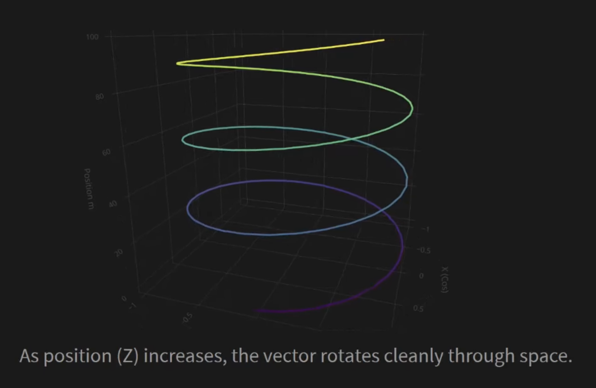

Modern language models like Llama 3, PaLM, and GPT-NeoX have all converged on a remarkably elegant solution for understanding word positions: Rotary Positional Encoding, or RoPE. The secret behind this powerful technique? A simple 2×2 rotation matrix from high school trigonometry.

## The Problem with Absolute Positioning

To understand RoPE's brilliance, we must first examine what it replaced. Early transformers like BERT and GPT-2 used absolute positional embeddings—essentially giving each word a fixed "street address." The approach was deceptively simple: take a token vector (representing meaning) and add a position vector (representing location).

Consider the phrase "the red car." The word "the" at position 0 gets its semantic vector plus position 0's vector. "Red" at position 1 gets its vector plus position 1's vector. Straightforward, right?

But here lies a fundamental flaw: **language is inherently relative, yet these addresses are absolute.**

### The Shifting Position Problem

Observe what happens when the same word appears at different positions:

- Sentence 1: "The red car is fast" — "red" is at position 1
- Sentence 2: "I saw the red car" — "red" is at position 3

With absolute embeddings, the model receives completely different input vectors for the same word. The first case adds position 1's vector, the second adds position 3's. This addition fundamentally alters the vector's properties, including its norm (length), which represents semantic meaning. These are entirely unrelated inputs, forcing the model to relearn word meanings and relationships at every position. This is a massively inefficient approach.

## The Dream: Relative Positional Information

The ideal system should encode positions such that the attention score between two words depends only on:

1. Their **content** (represented by query Q and key K vectors)
2. Their **relative distance** (m - n)

The absolute positions m and n should be irrelevant. This is where RoPE enters.

## The Geometric Split: RoPE's Core Innovation

RoPE's solution is breathtakingly elegant: **instead of adding positional information, we rotate it.**

This approach leverages what we might call the "geometric split" by separating a vector's properties into two distinct jobs:

- The **length** (norm) continues to represent semantic meaning (the *what*)
- The **direction** (angle) now represents token position (the *where*)

This separation is brilliant because we can change position by changing direction without touching length, thereby preserving the original semantic meaning. It's a perfect separation of concerns.

## From 2D Rotation to High-Dimensional Vectors

The standard 2D rotation matrix is familiar from high school mathematics:

```
[cos θ   -sin θ] [x]
[sin θ    cos θ] [y]
```

To verify this preserves meaning, consider rotating vector [1, 2] by 90°. The original length is √5, and after rotation to [-2, 1], the length remains √5. Semantic meaning intact—only the direction changed.

### Mapping Position to Rotation

The rule connecting position to rotation angle is beautifully simple:

**Rotation angle = position (m) × base angle (θ)**

- Position 0: rotation = 0 (baseline, no rotation)
- Position 1: rotation = θ (small spin)
- Position 2: rotation = 2θ (double spin)
- Position 3: rotation = 3θ (triple spin)



This creates a geometric helix. When we visualize these 2D rotations against the z-axis representing position, each step up in position (along the z-axis) corresponds to a predictable twist through the xy-plane, forming an elegant spiral structure.

## Scaling to 4,096 Dimensions

Modern models like Llama 3 use vectors with 4,096 dimensions. A direct rotation would require a 4,096×4,096 matrix (over 16 million numbers just to rotate one vector). Computationally infeasible.

The solution: **instead of one giant rotation, perform 2,048 small ones.**

### The Pairwise Split Strategy

We divide the input vector into pairs:
- x₀ and x₁ become pair 0
- x₂ and x₃ become pair 1
- And so on...

We've transformed one massive problem into thousands of tiny 2D problems we already know how to solve.

### The Multi-Speed Clock System

If all pairs rotated at the same speed, the system would be ambiguous. RoPE borrows inspiration from analog clocks, which have hands rotating at different speeds—seconds, minutes, hours. The combination of these different speeds gives every moment a unique signature.


Similarly, each dimension pair in RoPE rotates at a different frequency, controlled by:

**θᵢ = 10,000^(-2i/d)**

When i = 0 (first pair), the exponent is zero, so θ = 1 (fast rotation). When i is large (last pairs), θ approaches zero (slow rotation). Early dimensions spin like second hands; later dimensions move like hour hands.

### The Complete Algorithm

For any vector x at position m and each pair i:

1. Calculate frequency: θᵢ = 10,000^(-2i/d)
2. Calculate final angle: m × θᵢ
3. Rotate the pair (x₂ᵢ, x₂ᵢ₊₁) by this angle

Consider a 4D vector [1.0, 0.5, 0.8, 0.3] at position m = 2:

**Pair 0** (1.0, 0.5): θ₀ = 1, angle = 2 radians → significant change to [0.875, 0.7]

**Pair 1** (0.8, 0.3): θ₁ = 0.01, angle = 0.02 radians → minimal change to [0.794, 0.316]

The system is deterministic, parameter-free, and requires zero training (just pure mathematics).

## The Mathematical Proof

Why does this work? The answer lies in the attention mechanism's dot product.

Since we are currently considering a single query vector at position m and a single key vector at position n, we use lowercase notation: **q** and **k**. Both vectors share rotation frequency θ. 

In mathematics, vectors are by default considered as column vectors. Therefore, to compute the dot product (which gives us the attention score), we use qᵀ @ k (the transposed query times the key).

1. Apply RoPE: q' = R(mθ)q and k' = R(nθ)k
2. Compute score: q'ᵀk' = (R(mθ)q)ᵀk' = qᵀR(mθ)ᵀR(nθ)k

Using two properties of rotation matrices:
- **Transpose is inverse**: R(α)ᵀ = R(−α)
- **Multiplication adds angles**: R(α)R(β) = R(α+β)

The middle term simplifies:

R(mθ)ᵀR(nθ) = R(−mθ)R(nθ) = R((n−m)θ)

The absolute positions m and n have vanished completely. What remains is only the relative distance (n − m).

The final score depends solely on:
- Original content (q and k)
- Relative position (n − m)

**The proof is complete.**

### Why Not Use the Simplified Form Directly?

You might wonder: if R((n−m)θ) is the simplified form, why don't implementations compute this directly instead of rotating Q and K separately then computing Q'ᵀK'?

The answer is practical efficiency. In transformers, we compute attention between one query and many keys simultaneously (via batched matrix multiplication). By pre-rotating all Q and K vectors once, we can then compute all attention scores with a single batched operation. If we computed R((n−m)θ) for each query-key pair, we'd need to calculate different rotation matrices for every pair, which is far more expensive. The separate rotation approach enables vectorization and leverages GPU parallelism optimally.

## Implementation: From Theory to Code

The implementation follows a clean two-part strategy:

### Part 1: Precomputation

Calculate all rotation angles once and cache them:

```python
def precompute_rope_freqs(dim, max_seq_len, base=10000):
    """
    Precompute rotation frequencies for RoPE.
    
    Args:
        dim: Head dimension (e.g., 128)
        max_seq_len: Maximum sequence length (e.g., 2048)
        base: Base for frequency calculation (default: 10000)
    
    Returns:
        angles: shape (max_seq_len, dim)
                Precomputed angles for each position and dimension
    """
    # Calculate frequencies: shape (dim/2,)
    # freqs = [1.0, 10000^(-2/dim), 10000^(-4/dim), ...]
    freqs = 1.0 / (base ** (torch.arange(0, dim, 2).float() / dim))
    
    # Position indices: shape (max_seq_len,)
    # t = [0, 1, 2, ..., max_seq_len-1]
    t = torch.arange(max_seq_len)
    
    # Outer product: every position × every frequency
    # angles: shape (max_seq_len, dim/2)
    angles = torch.einsum('i,j->ij', t, freqs)
    
    # Duplicate for vector pairs: shape (max_seq_len, dim)
    # Each angle appears twice: [θ₀, θ₀, θ₁, θ₁, ...]
    angles = torch.repeat_interleave(angles, 2, dim=1)
    
    return angles
```

### Part 2: Application

The vectorized rotation leverages a clever insight. The standard rotation can be rewritten as:

**x' = x·cos(θ) + (−y, x)·sin(θ)**

The "partner vector" is created by swapping and negating: if the pair is [x₀, x₁], the partner becomes [−x₁, x₀].

```python
def apply_rotary_pos_emb(x, freqs):
    """
    Apply rotary positional embeddings to input tensor.
    
    Args:
        x: Input tensor, shape (batch_size, seq_len, num_heads, head_dim)
           or (batch_size, seq_len, dim)
        freqs: Precomputed angles, shape (seq_len, head_dim) or (seq_len, dim)
    
    Returns:
        Rotated tensor with same shape as input
    """
    # Slice angles to match sequence length: shape (seq_len, dim)
    freqs = freqs[:x.shape[1]]
    
    # Reshape for broadcasting: shape (1, seq_len, 1, head_dim)
    # This allows element-wise operations across batch and heads
    freqs = freqs.unsqueeze(0).unsqueeze(2)
    
    # Calculate cosine and sine: both shape (1, seq_len, 1, head_dim)
    cos = torch.cos(freqs)
    sin = torch.sin(freqs)
    
    # Create partner vector (swap and negate)
    # Reshape to view pairs: shape (..., dim/2, 2)
    x_reshaped = x.reshape(*x.shape[:-1], -1, 2)
    
    # Stack swapped and negated: shape (..., dim/2, 2)
    # Changes [x₀, x₁] pairs to [−x₁, x₀]
    x_partner = torch.stack([-x_reshaped[..., 1], 
                              x_reshaped[..., 0]], dim=-1)
    
    # Flatten back to original shape: shape (batch_size, seq_len, num_heads, head_dim)
    x_partner = x_partner.reshape(x.shape)
    
    # Vectorized rotation: output shape matches input
    # Performs millions of 2D rotations in parallel
    return x * cos + x_partner * sin
```

This single line performs potentially millions of 2D rotations in parallel.

For Llama 3 8B processing your prompt, this function executes 32 times per layer—once for queries and once for keys in each attention head. Simple code, massive impact.

## The Power of Inductive Bias

RoPE represents a profound principle in machine learning. There are two approaches to teaching models about the world:

**The Hard Way (Blank Slate):** Force the model to learn fundamental concepts like distance from trillions of examples. Brute force. Wildly inefficient.

**The RoPE Way (Inductive Bias):** Build understanding directly into the geometry of the space itself. The model is correct from day one.

This isn't merely a clever hack—it's a masterclass in model design. Instead of making the model discover that "one position away" means something consistent, we encoded this truth into the mathematical structure itself.

## Conclusion

What initially seemed complex and mysterious has dissolved into elegant, understandable mathematics. A simple 2×2 rotation matrix, applied with geometric insight, now powers the world's most advanced language models.

RoPE's genius lies not in its complexity, but in its simplicity—the recognition that position is rotation, that meaning lives in magnitude while location lives in direction, and that relative relationships matter more than absolute addresses.

High school trigonometry, it turns out, was exactly what we needed all along.

## References:
- [Give me 30 min, I will make RoPE click forever](https://www.youtube.com/watch?v=hCzJo4ui1P8)
- [Rotary Positional Encoding (RoPE): A Deep Dive](https://github.com/The-Pocket/PocketFlow-Tutorial-Video-Generator/blob/main/docs/llm/rope.md)